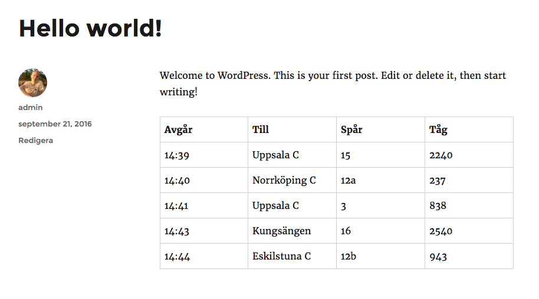

# TuffTuffTime

With this WordPress plugin you can display, via a shortcode, a list of arriving/departing trains at a given station in Sweden.

You have to register an account at [Trafiklab](https://www.trafiklab.se/) and create an application that uses [Trafikverkets Open API](https://www.trafiklab.se/api/trafikverket-oppet-api) to use TuffTuffTime. You should then be able to create an API-key that can be used with this plugin.

The spelling of the station name must be exactly the same as in the API. There is a list of all stations on the plugin settings page.

**Example of the shortcode:** `[tufftufftime station="Stockholm Central" limit="5" type="arriving"]`

## Installation
1. Upload the folder `TuffTuffTime` to the `/wp-content/plugins/` directory.
2. Activate the plugin through the 'Plugins' menu in WordPress.
3. Add an valid API-key for a project that uses the [Trafikverkets Open API](https://www.trafiklab.se/api/trafikverket-oppet-api).
4. Use the shortcode (`[tufftufftime station="Stockholm Central" limit="5" type="arriving"]`) in any post or page.

## Screenshots

Example of output when using the shortcode.

## Changelog

### 2.0
* Complete rewrite.

### 1.0
* First release.
